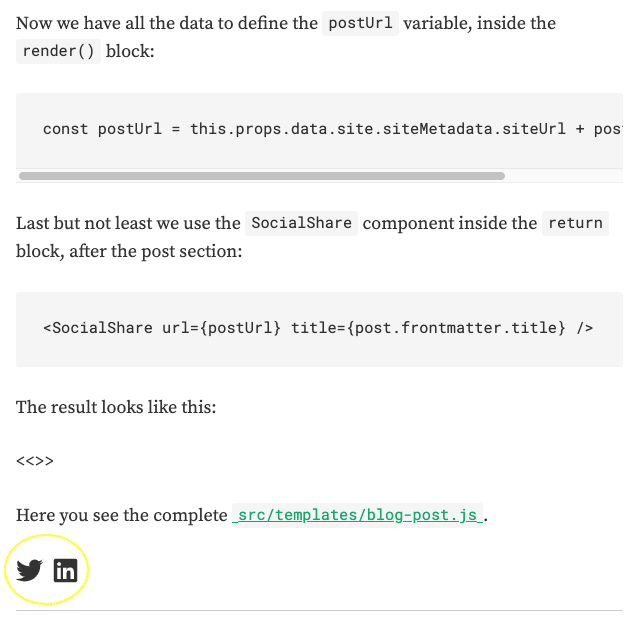

This blog is based on [Gatsby](https://www.gatsbyjs.org) and initiated from [Gatsby's blog starter](https://www.gatsbyjs.org/starters/gatsbyjs/gatsby-starter-blog/); boilerplate for a full-featured blog. While it provides a lot of useful features for a blog, it also leaves plenty of room for customization, which is something I like.

In this post, I go through how to add functionality to share posts into social media platforms like Twitter and Linked In.

Since I know that Gatsby has a plugin library, my first thought was to find a suitable plugin from there, but I couldn't find any. It is interesting because social media sharing is a pretty basic functionality for any blog, in my opinion. It started to seem that this but would not let me off easy. – since one of the primary purposes of this blog is to learn different things, it's okay.

After a little search in Google, GitHub and npmjs.com, I found packages called [`react-share`](https://www.npmjs.com/package/react-share) and [`react-icons`](https://www.npmjs.com/package/react-icons), those looked sufficient for my purpose. _– I based my decision to use these packages out of dozens of other packages on their popularity and the fact that there were releases made recently._

Now I only needed to find my way over creating and using a React component.

//TODO: Learn more about [React components](https://reactjs.org/tutorial/tutorial.html).

Okay. First of all, let's install the packages and their dependencies by:

```bash
yarn add react-share react-icons
```

Then create new React component under `src/components/share.js`:

```javascript
/**
 * A component to share pages to social media platforms.
 */

import React from "react"
import PropTypes from "prop-types"

import {
  TwitterShareButton,
  LinkedinShareButton,
} from "react-share"

import { IconContext } from "react-icons"
import { FaTwitter, FaLinkedin } from "react-icons/fa"

const SocialShare = props => {
  const { url, title } = props

  const shareBlockProps = {
    url: url,
    title: title,
  }

  return (
    <IconContext.Provider
      value={{
        size: "1.5rem",
        className: "share",
        style: { marginRight: "0.5rem", marginBottom: "1.0rem" },
      }}
    >
      <div>
        <TwitterShareButton {...shareBlockProps}>
          <FaTwitter />
        </TwitterShareButton>
        <LinkedinShareButton {...shareBlockProps}>
          <FaLinkedin />
        </LinkedinShareButton>
      </div>
    </IconContext.Provider>
  )
}

SocialShare.propTypes = {
  url: PropTypes.string,
  title: PropTypes.string,
}

SocialShare.defaultProps = {
  url: "https://cloudgardener.dev/",
  title: "Post with no title.",
}

export default SocialShare
```

To enable this newly created component for blog posts, we need to adjust the post template in `src/templates/blog-post.js`.

Let's start by importing the component:

```javascript
import SocialShare from "../components/share"
```

Then gather information needed from page data.

The `SocialShare` component currently takes in two properties, `url` and `title`, and to be able to fill those, we need to adjust the `pageQuery` by adding `siteUrl` and `fields { slug }` into it:

```javascript
export const pageQuery = graphql`
  query BlogPostBySlug($slug: String!) {
    site {
      siteMetadata {
        title
        siteUrl
      }
    }
    markdownRemark(fields: { slug: { eq: $slug } }) {
      id
      excerpt(pruneLength: 160)
      html
      fields {
        slug
      }
      frontmatter {
        title
        date(formatString: "MMMM DD, YYYY")
        description
      }
    }
  }
`
```

Now we have all the data to define the `postUrl` variable, inside the `render()` block:

```javascript
const postUrl =
  this.props.data.site.siteMetadata.siteUrl + post.fields.slug
```

Last but not least we use the `SocialShare` component inside the `return` block, after the post section:

```html
<SocialShare url="{postUrl}" title="{post.frontmatter.title}" />
```

The result looks like this:



Here you can see the complete [`src/templates/blog-post.js`](https://github.com/cloudgardener/blog/blob/master/src/templates/blog-post.js).

That's about it! Now I have a functional social media sharing on my blog. What's next? – Who knows. :)

> "Every day, work to refine the skills you have and to add new tools to your repertoire."
> ― Andrew Hunt, The Pragmatic Programmer: From Journeyman to Master

Sincerely yours, your Cloud Gardener,

/niko
